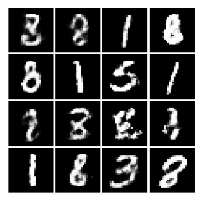
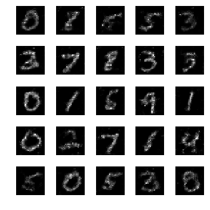
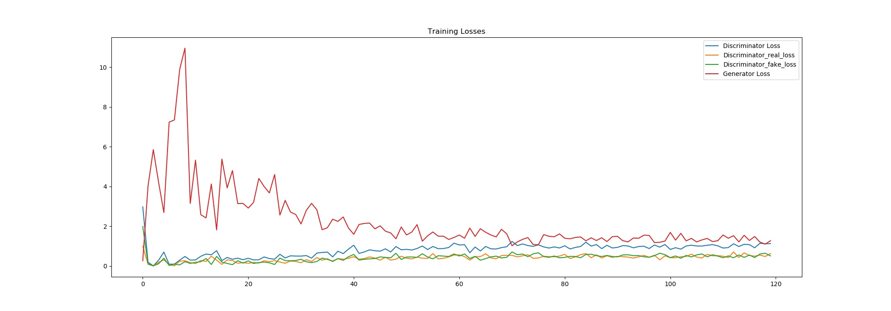
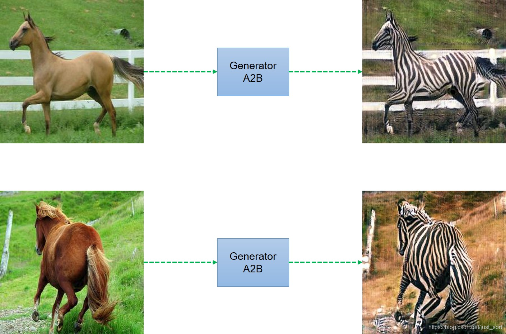

# GAN-Code

- GAN.pdf 原始的对抗生成网络论文。

- GAN.py 原始GAN的tensorflow实现，细节可以查看：https://blog.csdn.net/just_sort/article/details/79454054 ,运行80个epoch生成的结果为：



- DCGAN.pdf 卷积对抗生成网络的论文原文。

- DCGAN.py 使用Keras实现DCGAN生成MNIST数据集，训练和测试方法如下：

  ```python
  训练： python dcgan.py --mode train --batch_size <batch_size>
  测试： python dcgan.py --mode generate --batch_size <batch_size> --nice
  ```

- DCGAN_face.py 使用Tensorflow实现DCGAN生成人脸，数据集的格式为：

 ，

细节可以查看：https://blog.csdn.net/just_sort/article/details/84581400

- SGAN.pdf 《Semi-Supervised Learning with Generative Adversarial Networks》论文

- SGAN.py SGAN的tensorflow实现，细节可以查看：https://blog.csdn.net/just_sort/article/details/90605197 ，每个batch真实样本占比0.1运行1000个epoch的生成结果为：
  
- 
  
- CGAN.pdf 条件GAN的论文原文。

- CGAN.py 使用Tensorflow实现CGAN生成特定类别的手写数字。CGAN的损失函数下降过程为：

  

- CGAN_fashion_mnist.py 使用Tensorflow实现CGAN生成时尚衣柜，数据集可以通过[数据下载脚本](data/fashion_mnist_download.py)进行下载，然后将数据集放在和当前py文件同一目录下执行。迭代13000次产生的外套的结果为：


- CycleGAN.pdf CycleGAN论文原文。

- CycleGAN.py 用于风格迁移，两个模式相互转换，例如将马和斑马相互转换：



